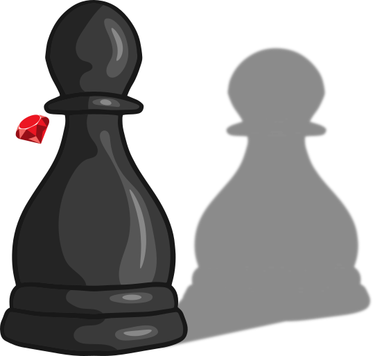

## Chess on Ruby

  

This is my project for TOP's Ruby course final assignment. 
> **NOTE:** This code base is very messy. I'm yet to implement check and checkmate (end_game) modules which will scan the whole board and find any enemy piece with a valid move to your king's position. End_game will check if the current player has any valid moves that will **not** result in check.

# How to run

To run this game, you'll need to install ruby. Then just type the following into your terminal:

    git clone https://github.com/LazyKitKat/ChessOnRuby
    cd ChessOnRuby
    ruby main.rb

# How to play

First, you'll need to choose if you want to load or start a new game. 
Then you'll be in the game, where you switch turns.

Each turn consists of choosing either a figure to move and its destination (selecting fields is done by tiping a letter, followed by a number, eg. "A2"), or castling (which is done by typing c while selecting a figure).

Modules for en passant exist, as well as promotion which is done when the pawn reaches it's end destination. 

# Screenshot

# Thanks

Big thanks to TOP's Discord channel. You guys rock!
